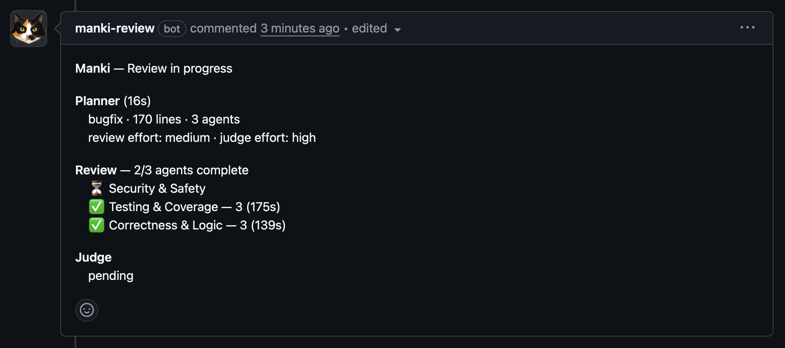
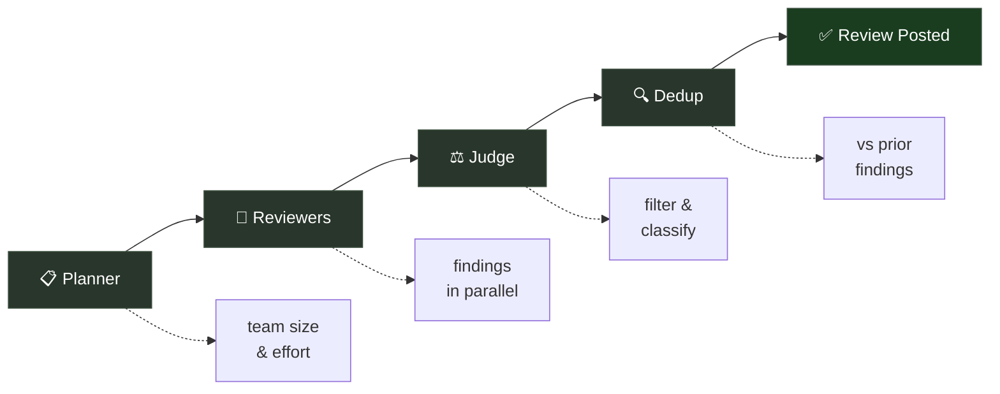

<p align="center">
  
</p>

<h1 align="center">Manki — curious, thorough, and always learning</h1>

<p align="center">
  <a href="https://github.com/xdustinface/manki/actions/workflows/ci.yml"></a>
  <a href="https://codecov.io/gh/xdustinface/manki"></a>
</p>

<p align="center"><strong>Your tokens, your rules.</strong> Self-hosted AI code review that runs on your own GitHub runners and learns from your team.</p>

Manki assembles a dynamic review team sized to your PR's content and complexity. A judge filters noise, dedups against prior reviews, and manki learns your team's conventions over time.

<p align="center">
  
</p>

## Why Manki

- **Multi-stage pipeline** — a planner picks the team, agents review in parallel, a judge filters noise, dedup catches repeats from prior reviews
- **Adaptive team sizing** — 1, 3, 5, or 7 reviewers chosen per PR based on content and complexity
- **Self-learning memory** — teach manki via `/manki remember`; it remembers dismissed findings and your team's conventions across PRs
- **Self-hosted GitHub Action** — your API key, your compute, no SaaS intermediary

## Quick start

1. **Install the app** — [github.com/apps/manki-review](https://github.com/apps/manki-review)
2. **Add a Claude secret** — `gh secret set CLAUDE_CODE_OAUTH_TOKEN`
3. **Add the workflow** — copy the YAML from the [Setup Guide](SETUP.md#step-3-add-the-workflow)

Full setup guide with memory, triage, and troubleshooting: **[SETUP.md](SETUP.md)**

## How it works

Manki wakes up when a PR is opened. A fast planner (Haiku) picks the team size and effort, reviewers work in parallel, the judge evaluates each finding, and dedup filters repeats from prior reviews. Results land as inline comments plus a summary and verdict. When all blocking threads resolve, manki approves.



See [SETUP.md](SETUP.md#review-pipeline) for the full walkthrough.

## Talk to Manki

| Command | What it does |
|---------|-------------|
| `/manki review` | Trigger a full multi-agent review |
| `/manki explain [topic]` | Ask about the PR changes |
| `/manki dismiss [finding]` | Dismiss a finding (stored as suppression in memory) |
| `/manki remember <instruction>` | Teach it something for future reviews |
| `/manki remember global: <instruction>` | Teach globally (applies to all repos) |
| `/manki check` | Check thread resolution and auto-approve if clear |
| `/manki triage` | Process nit issue checkboxes into work issues + suppressions |
| `/manki forget <text>` | Remove a learning matching the text |
| `/manki forget suppression <pattern>` | Remove a suppression matching the pattern |
| `/manki help` | Show all commands |

You can also use `@manki` as the command prefix, or reply to any review comment to start a conversation. Tip: edit a comment to add `/manki` if you forgot to include it.

## Configure

Create `.manki.yml` in your repo root:

```yaml
auto_review: true
auto_approve: true
exclude_paths: ["*.lock"]
review_level: auto      # auto | small | medium | large

instructions: |
  This is a Rust project. Focus on ownership and error handling.

models:
  planner: claude-haiku-4-5
  reviewer: claude-sonnet-4-6
  judge: claude-opus-4-6
  dedup: claude-haiku-4-5
```

See [`.manki.yml.example`](.manki.yml.example) for all options, or [SETUP.md](SETUP.md) for the full guide.

## Security

Secrets are masked, PR content is sanitized before posting, and memory access is restricted to repo collaborators. See [SETUP.md](SETUP.md#security) for the full security model.

## License

AGPL-3.0
